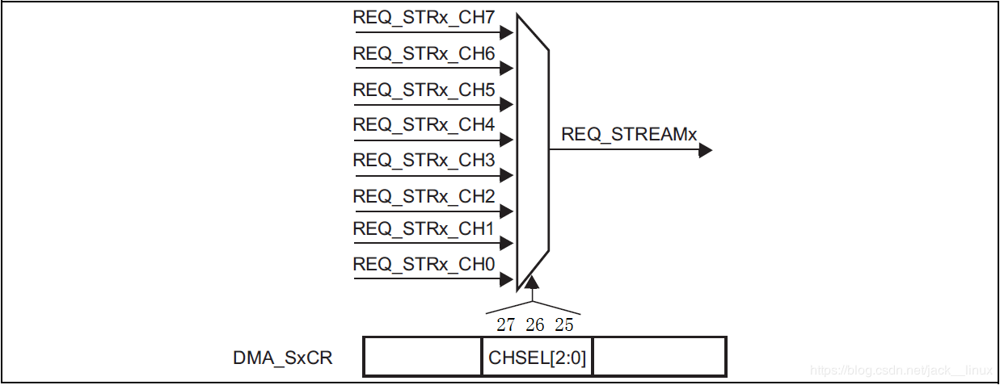
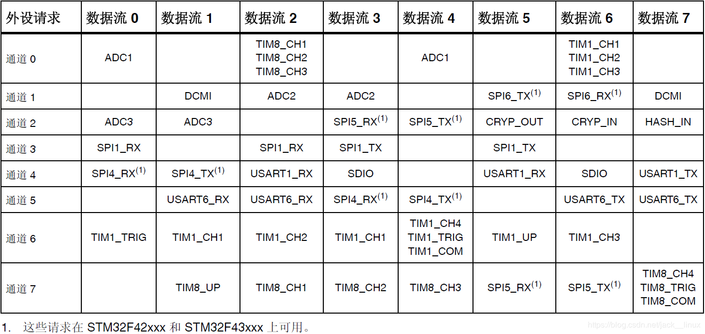

# 串口DMA方式发送&接收
笔者使用的是STM32F407VET6，共包含6路串口，页尾处程序已将全部串口的DMA收发配置完成，本文仅以串口1为例进行讲解。

该工程为寄存器版本，不过在库函数中仍可添加使用

使用资源：
| Model  | DMA               | I/O       |
| ------ |:-----------------:|:---------:|
| USART1 | DMA2_7_CH4 (USART1_TX)<br>DMA2_5_CH4 (USART1_RX) | PA9<br>PA10  |
| USART2 | DMA1_6_CH4 (USART2_TX)<br>DMA1_5_CH4 (USART2_RX) | PA2<br>PA3   |
| USART3 | DMA1_3_CH4 (USART3_TX)<br>DMA1_1_CH4 (USART3_RX) | PB10<br>PB11 |
| UART4  | DMA1_4_CH4 (USART4_TX)<br>DMA1_2_CH4 (USART4_RX) | PA0<br>PA1   |
| UART5  | DMA1_7_CH4 (USART5_TX)<br>DMA1_0_CH4 (USART5_RX) | PC12<br>PD2  |
| USART6 | DMA2_6_CH5 (USART6_TX)<br>DMA2_1_CH5 (USART6_RX) | PC6<br>PC7   |

【中断】:6个串口空闲接收中断，6个DMA接收完成中断（共12个，设置为组2，优先级(3,3)~(1,0)）

## 1 STM32F4 DMA 简介  
DMA，全称为：Direct Memory Access，即直接存储器访问。DMA 传输方式无需 CPU 直接控制传输，也没有中断处理方式那样保留现场和恢复现场的过程，通过硬件为 RAM 与 I/O 设备开辟一条直接传送数据的通路，能使 CPU 的效率大为提高。  
STM32F4 最多有 2 个 DMA 控制器（DMA1 和 DMA2），共 16 个数据流（每个控制器 8 个），每一个 DMA 控制器都用于管理一个或多个外设的存储器访问请求。每个数据流总共可以有多达 8个通道（或称请求）。每个数据流通道都有一个仲裁器，用于处理 DMA 请求间的优先级。  

它可以处理一下事务：

1.外设到储存器的传输
2.储存器到外设的传输
3.储存器到储存器的传输

> 【注】：DMA1 控制器 AHB 外设端口与 DMA2 控制器的情况不同，不连接到总线矩阵，因此，仅 DMA2 数据流能够执行存储器到  

存储器的传输。

其中，数据流的多通道选择，是通过 DMA_SxCR 寄存器控制的，如图1所示：

<p align="center"></p>
<p align="center" style="color:orange; font-size:14px; color: #999; " >图1 通道选择</p>

上图可以看出，DMA_SxCR 控制数据流到底使用哪一个通道，每个数据流有 8 个通道可供选择，但每次只能选择其中一个通道进行 DMA 传输，DMA2 的各数据流通道映射表，如表 1 所示

<p align="center"></p>
<p align="center" style="color:orange; font-size:14px; color: #999; " >1 DMA2数据流映射表</p>

上表就列出了 DMA2 所有可能的选择情况，来总共 64 种组合，比如本章我们要实现串口1的 DMA 发送，即USART1_TX，就必须选择 DMA2 的数据流 7，通道 4，来进行 DMA 传输。这里注意一下，有的外设（比如 USART1_RX）可能有多个通道可以选择，随意选择一个就可以。

## 重要寄存器简介

**（1） DMA 中断状态寄存器**

该寄存器总共有 2 个：DMA_LISR 和 DMA_HISR，每个寄存器管理 4 数据流（总共 8 个），DMA_LISR 寄存器用于管理数据流 0~3，而 DMA_HISR 用于管理数据流 4~7。如果开启了 DMA_LISR 中这些位对应的中断，则在达到条件后就会跳到中断服务函数里面去，即使没开启，也可以通过查询这些位来获得当前 DMA 传输的状态。这里常用的是 TCIFx位，即数据流 x 的 DMA 传输完成与否标志。

> 【注意】：此寄存器为只读寄存器，所以在这些位被置位之后，只能通过【中断标志清除寄存器】来清除。

**（2）DMA 中断标志清除寄存器**  

该寄存器同样有 2 个：DMA_LIFCR 和 DMA_HIFCR，同样是每个寄存器控制 4 个数据流。该寄存器为只写寄存器，其各位就是用来清除 【中断状态寄存器】的对应位的，通过写 1 清除。

**（3） DMA 数据流 x 配置寄存器（DMA_SxCR）**

 该寄存器控制着 DMA 的很多相关信息，包括数据宽度、外设及存储器的宽度、优先级、增量模式、传输方向、中断允许、使能等都是通过该寄存器来设置的。所以 DMA_ SxCR 是 DMA 传输的核心控制寄存器。
 
**（4）DMA 数据流 x 数据项数寄存器（DMA_SxNDTR）**
 
 这个寄存器控制 DMA 数据流 x 的每次传输所要传输的数据量。其设置范围为 0~65535。并且该寄存器的值会随着传输的进行而减少，当该寄存器的值为 0 的时候就代表此次数据传输已经全部发送完成了。所以可以通过这个寄存器的值来知道当前DMA 传输的进度。
 
 > 【注意】：这里是数据项数目，而不是指的字节数。比如设置数据位宽为 16 位，那么传输一次（一个项）就是 2 个字节

**（5）DMA 数据流 x 的外设地址寄存器（DMA_SxPAR）**

该寄存器用来存储 STM32F4 外设的地址，比如使用串口 1，那么该寄存器必须写入 0x40011004（其实就是&USART1_DR）。

**（6） DMA 数据流 x 的存储器地址寄存器**

由于 STM32F4 的 DMA 支持双缓存，所以存储器地址寄存器有两个：DMA_SxM0AR 和 DMA_SxM1AR，其中 DMA_SxM1AR 仅在双缓冲模式下，才有效。比如使用 USART1_TX_BUF[USART_LEN] 数组来做存储器，那么在DMA_SxM0AR 中写入 &USART1_TX_BUF 就可以了。

## 2 收发配置

### 2.1串口配置（使能DMA收发）

重点：使能串口1的接收、发送和串口1的DMA接收、发送并使能串口1的空闲中断

```
/*------------------------------------------------  
* 函数名：void Init_USART1(u32 pclk2,u32 bound)  
* 功  能：初始化IO 串口1  
* 参  数：pclk2: PCLK2时钟频率(Mhz)  
	      bound: 波特率   
* 返回值： 无  
------------------------------------------------*/  
void Init_USART1(u32 pclk2,u32 bound)  
{  	   
	float temp;  
	u16 mantissa;  
	u16 fraction;	     
	temp=(float)(pclk2*1000000)/(bound*16);//得到USARTDIV@OVER8=0  
	mantissa=temp;				 //得到整数部分  
	fraction=(temp-mantissa)*16; //得到小数部分@OVER8=0   
        mantissa<<=4;  
	mantissa+=fraction;   
	RCC->AHB1ENR|=1<<0;   	//使能PORTA口时钟    
	RCC->APB2ENR|=1<<4;  	//使能串口1时钟   
	GPIO_Set(GPIOA,PIN9|PIN10,GPIO_MODE_AF,GPIO_OTYPE_PP,GPIO_SPEED_50M,GPIO_PUPD_PU);//PA9,PA10,复用功能,上拉输出  
 	GPIO_AF_Set(GPIOA,9,7);	//PA9,AF7  
	GPIO_AF_Set(GPIOA,10,7);//PA10,AF7  	     
	//波特率设置  
 	USART1->BRR=mantissa; 	//波特率设置	   
	USART1->CR1&=~(1<<15); 	//设置OVER8=0   
	  
	USART1->CR1|=1<<3;  	//串口发送使能   
	USART1->CR3|=1<<7;      //使能串口1的DMA发送  
	   
#if EN_USART1_RX		  	//如果使能了接收  	
	USART1->CR1|=1<<2;  	//串口接收使能  
	USART1->CR3|=1<<6;      //使能串口1的DMA接收    
	USART1->CR1|=1<<4;    	//使能空闲中断  	    	
	MY_NVIC_Init(3,3,USART1_IRQn,2);//组2，最低优先级   
#endif  
	USART1->CR1|=1<<13;  	//串口使能  
}  
```

### 2.2两个变量

发送和接收的数据都将以如下两个变量为指定储存器。

```
#define USART_LEN  	50  	//定义最大接收字节数 50  
u8 USART1_TX_BUF[USART_LEN];  
u8 USART1_RX_BUF[USART_LEN];  
```  
### 2.3 DMA配置

（1）使能DMA2时钟，并等待数据流可配置 。

（2）设置外设地址

（3）设置储存器地址

（4）设置传输数据量

（5）设置数据流7的配置信息

（6）开启数据流7的传输完成中断

```
/*------------------------------------------------  
* 函数名：void MYDMA_Config(DMA_Stream_TypeDef *DMA_Streamx,u8 chx,u32 par,u32 mar,u16 ndtr,u8 dir)  
* 功  能：配置DMA  
* 参  数：DMA_Streamx: DMA数据流（DMA1_Stream0~7/DMA2_Stream0~7）  
	     chx: DMA通道选择（范围:0~7）  
	     par: 外设地址  
		 mar: 存储器地址  
		 ndtr: 数据传输量  
		 dir： 数据传输方向（DMA_DIR_PeripheralToMemory / DMA_DIR_MemoryToPeripheral / DMA_DIR_MemoryToMemory）  
* 返回值： 无  
------------------------------------------------*/  
void MYDMA_Config(DMA_Stream_TypeDef *DMA_Streamx,u8 chx,u32 par,u32 mar,u16 ndtr,u8 dir)  
{   
	DMA_TypeDef *DMAx;  
	u8 streamx;  
	if((u32)DMA_Streamx>(u32)DMA2)//得到当前stream是属于DMA2还是DMA1  
	{  
		DMAx=DMA2;  
		RCC->AHB1ENR|=1<<22;//DMA2时钟使能     
	}else   
	{  
		DMAx=DMA1;   
 		RCC->AHB1ENR|=1<<21;//DMA1时钟使能   
	}  
	while(DMA_Streamx->CR&0X01);//等待DMA可配置   
	streamx=(((u32)DMA_Streamx-(u32)DMAx)-0X10)/0X18;		//得到stream通道号  
 	if(streamx>=6)DMAx->HIFCR|=0X3D<<(6*(streamx-6)+16);	//清空之前该stream上的所有中断标志  
	else if(streamx>=4)DMAx->HIFCR|=0X3D<<6*(streamx-4);    //清空之前该stream上的所有中断标志  
	else if(streamx>=2)DMAx->LIFCR|=0X3D<<(6*(streamx-2)+16);//清空之前该stream上的所有中断标志  
	else DMAx->LIFCR|=0X3D<<6*streamx;			//清空之前该stream上的所有中断标志  
	    
	DMA_Streamx->PAR=par;		//DMA外设地址      
	DMA_Streamx->M0AR=mar;		//DMA存储器0地址        
	DMA_Streamx->NDTR=ndtr;		//n个数据项  
	DMA_Streamx->CR=0;			//先全部复位CR寄存器值   
   
	switch(dir)  
	{    
		case DMA_DIR_PeripheralToMemory: //外设到存储器模式  
			DMA_Streamx->CR&=~(1<<6);  
			DMA_Streamx->CR&=~(1<<7);    
			break;      
		case DMA_DIR_MemoryToPeripheral:         
			DMA_Streamx->CR|=1<<6;          
			DMA_Streamx->CR&=~(1<<7);            
			break;  
		case DMA_DIR_MemoryToMemory:     
			DMA_Streamx->CR&=~(1<<6);      
			DMA_Streamx->CR|=1<<7;  
			break;  
		default:break;    
	}  
	DMA_Streamx->CR|=0<<8;		//非循环模式(即使用普通模式)  
	DMA_Streamx->CR|=0<<9;		//外设非增量模式  
	DMA_Streamx->CR|=1<<10;		//存储器增量模式  
	DMA_Streamx->CR|=0<<11;		//外设数据长度:8位  
	DMA_Streamx->CR|=0<<13;		//存储器数据长度:8位  
	DMA_Streamx->CR|=1<<16;		//中等优先级  
	DMA_Streamx->CR|=0<<21;		//外设突发单次传输  
	DMA_Streamx->CR|=0<<23;		//存储器突发单次传输  
	DMA_Streamx->CR|=(u32)chx<<25;//通道选择  
	//DMA_Streamx->FCR=0X21;	//FIFO控制寄存器  
   
        DMA2_Stream7->CR|=1<<4;		//使能传输完成中断  
        MY_NVIC_Init(2,1,DMA2_Stream7_IRQn,2);  
}
```
### 2.4 设置MDA状态标志

> 【注意】：如果连续运行两个发送函数，如下，则可能在第一个还未发送完成时就会直接执行第二次发送。

```
myDMAprintf(USART1,"usart = %d\tch = %f\r\n",1,1.567);  
myDMAprintf(USART1,"usart = %d\tch = %f\r\n",1,1.567);  
```
其运行效果如图1所示，第一次仅发送了"us"即被第二次发送覆盖了。

(截图插入无法显示，可在`Pictures\3.PNG`中查看)  

<p align="center"></p>
<p align="center" style="color:orange; font-size:14px; color: #999; " >2 运行效果</p>

故需设置相应的标志位，对每次发送的状态进行标记，若正在进行传输，则等待，实现如下：

```
typedef enum   
{  
	BUSY,  
	IDLE  
}DMA_Flag;  
   
volatile DMA_Flag DMA2_Stream7_Flag = IDLE;		//USART1  
```

### 2.5 DMA中断函数

每次传输完成（串口发送完成）后，都会触发一次中断，此时只需在中断函数中清除相应标志位并对发送状态进行标记即可。

```
//对应USART1发送  
void DMA2_Stream7_IRQHandler(void)  
{  
	if((DMA2->HISR&(1<<27)))  
	{  
		DMA2->HIFCR|=1<<27;  
                DMA2_Stream7_Flag = IDLE;  
	}  
}  
```

### 2.6 DMA初始化

查询手册可知，串口1发送为DMA2的数据流7，通道4，并为内存到外设模式，而串口1接收为DMA2的数据流5，通道4，并为外设到内存模式。

> 【注意】：此处需提前开启一次DMA接收，否则第一次接收会产生错误数据。

```
//USART1发送 --- DMA2,数据流7,CH4---USART1_TXD 外设为串口1,存储器为USART1_TX_BUF,长度为:USART_LEN  
MYDMA_Config(DMA2_Stream7,4,(u32)&USART1->DR,(u32)USART1_TX_BUF,USART_LEN,DMA_DIR_MemoryToPeripheral);  
//USART1接收 --- DMA2,数据流5,CH4---USART1_RXD 外设为串口1,存储器为USART1_RX_BUF,长度为:USART_LEN  
MYDMA_Config(DMA2_Stream5,4,(u32)&USART1->DR,(u32)USART1_RX_BUF,USART_LEN,DMA_DIR_PeripheralToMemory);  
MYDMA_Enable(DMA2_Stream5,(u32)USART1_RX_BUF,USART_LEN);//开始一次DMA传输！  
```

### 2.7 开启一次串口DMA传输

配置DMA数据流、内存地址及传输量。

```
void MYDMA_Enable(DMA_Stream_TypeDef *DMA_Streamx, u32 mar, u16 ndtr)  
{  
	DMA_Streamx->CR&=~(1<<0); 	//关闭DMA传输   
	while(DMA_Streamx->CR&0X1);	//确保DMA可以被设置    
	DMA_Streamx->M0AR=mar;		//DMA存储器地址  
	DMA_Streamx->NDTR=ndtr;		//DMA传输数据量   
	DMA_Streamx->CR|=1<<0;		//开启DMA传输  
}  
```

### 2.8 格式化发送

该部分已封装为类似printf()的发送函数，大致为3个部分：

（1）格式化数据为字符串；

（2）判断发送状态，若“忙”，则等待。

（3）设置好储存器地址，使能发送并设置发送状态；

```
/*------------------------------------------------  
* 函数名：Status myDMAprintf(USART_TypeDef *USARTx, const char *format, ...)  
* 功  能：仿 printf 函数   
* 参  数：*USARTx: 串口号  
	      *pString: 打印内容  
	      ... : 变量  
* 返回值： 状态  
------------------------------------------------*/  
Status myDMAprintf(USART_TypeDef *USARTx, const char *format, ...)  
{  
	va_list args; 	  
	u16 len;  
	  
	if(format == NULL)  
		return 1;  
	va_start(args, format);  
	  
	if(USARTx == USART1)  
	{  
		len = vsnprintf((char *)USART1_TX_BUF, USART_LEN, format, args);  
		while(DMA2_Stream7_Flag != IDLE);  
		MYDMA_Enable(DMA2_Stream7,(u32)USART1_TX_BUF,len);  
		DMA2_Stream7_Flag = BUSY;  
	}  
	else if(USARTx == USART2)   
	{  
		len = vsnprintf((char *)USART2_TX_BUF, USART_LEN, format, args);  
		while(DMA1_Stream6_Flag != IDLE);  
		MYDMA_Enable(DMA1_Stream6,(u32)USART2_TX_BUF,len);  
		DMA1_Stream6_Flag = BUSY;  
	}	  
	else if(USARTx == USART3)  
	{  
		len = vsnprintf((char *)USART3_TX_BUF, USART_LEN, format, args);  
		while(DMA1_Stream3_Flag != IDLE);  
		MYDMA_Enable(DMA1_Stream3,(u32)USART3_TX_BUF,len);  
		DMA1_Stream3_Flag = BUSY;  
	}	  
	else if(USARTx == UART4)  
	{  
		len = vsnprintf((char *)UART4_TX_BUF, USART_LEN, format, args);  
		while(DMA1_Stream4_Flag != IDLE);  
		MYDMA_Enable(DMA1_Stream4,(u32)UART4_TX_BUF,len);  
		DMA1_Stream4_Flag = BUSY;  
	}	  
	else if(USARTx == UART5)  
	{  
		len = vsnprintf((char *)UART5_TX_BUF, USART_LEN, format, args);  
		while(DMA1_Stream7_Flag != IDLE);  
		MYDMA_Enable(DMA1_Stream7,(u32)UART5_TX_BUF,len);  
		DMA1_Stream7_Flag = BUSY;  
	}	  
	else if(USARTx == USART6)  
	{  
		len = vsnprintf((char *)USART6_TX_BUF, USART_LEN, format, args);  
		while(DMA2_Stream6_Flag != IDLE);  
		MYDMA_Enable(DMA2_Stream6,(u32)USART6_TX_BUF,len);  
		DMA2_Stream6_Flag = BUSY;  
	}  
	else  
		return 2;  
	
	va_end(args);  
	  
	return 0;  
}
```

### 2.9 串口DMA接收

当串口进入空闲状态时即开启一次DMA接收，下次数据到来时DMA会自动搬运数据至指定的储存器（此处为USART1_TX_BUF），搬运完成后会再次触发空闲中断，此时清除空闲中断标志位、DMA传输完成标志位和传输错误标志位，并清除接收内存，开启下一次接收。

```
void USART1_IRQHandler(void)  
{  
	u8 temp;  
	u16 len;  
	  
	if(USART1->SR&(1<<4))//检测到线路空闲  
	{  
//软件序列清除IDLE标志位  
		temp = USART1->SR;  
		temp = USART1->DR;  
		  
		DMA2_Stream5->CR &=~(1<<0); //关闭DMA传输,准备重新配置  
		DMA2->HIFCR|=1<<11;			//清除DMA2_Steam5传输完成标志  
		DMA2->HIFCR|=1<<9;			//清除DMA2_Steam5传输错误标志  
	  
		len = USART_LEN - (uint16_t)(DMA2_Stream5->NDTR);  
		myDMAprintf(USART1,"len = %d,data: %s",len,USART1_RX_BUF);  
	}  
	mymemset(USART1_RX_BUF,0,(u32)len);  
	MYDMA_Enable(DMA2_Stream5,(u32)USART1_RX_BUF,USART_LEN);//开始一次DMA传输！  
}  
```

至此，串口1的发送和接收已全部配置完成，其他5个串口的配置类似。


# 参考文章

[STM32—无需中断来实现使用DMA接收串口数据](https://www.cnblogs.com/lifexy/p/7518488.html) 

[串口1配合DMA接收不定长数据（空闲中断+DMA接收）](https://www.cnblogs.com/luckytimor/p/7168810.html) 

[STM32 串口采用DMA方式收发](https://blog.csdn.net/gdjason/article/details/51019219) 

